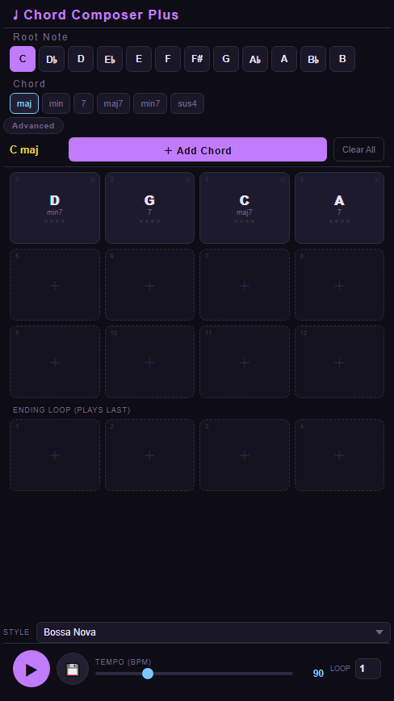

# Chord-Composer-Plus
A simple web-based application for creating and editing chord progressions. 
## Features
* The panel size is designed for smartphone screen display
* Select from a variety of chord qualities and root notes
* Add and remove chords from the progression grid
* Edit chord progression patterns and style settings
* Edit optional ending loop, which will be played after the end of main chord progression loop
* Export audio files in WAV format
## Usage
1. Open chord-composer-plus.html in a web browser to access the application.
2. Select a root note and chord quality from the dropdown menus.
3. Add chords to the progression grid by clicking the "Add Chord" button.
4. Edit chord progression patterns and style settings as needed.
5. Select rhythm patterns including Bossa Nova, Rumba, Power Chord, Ballad and Arpeggio from STYLE.
6. Click the "Play" button to play the chord progression repeated N times (N can be specified in "LOOP" cell) followed by ending sequence.
7. Export audio files (.wav) by clicking the "Export" button.

## Dependencies
* Modern web browser (Chrome, Firefox, etc.)
* HTML5 and CSS3 capabilities
## License
This project is released under the [MIT License](https://opensource.org/licenses/MIT).
