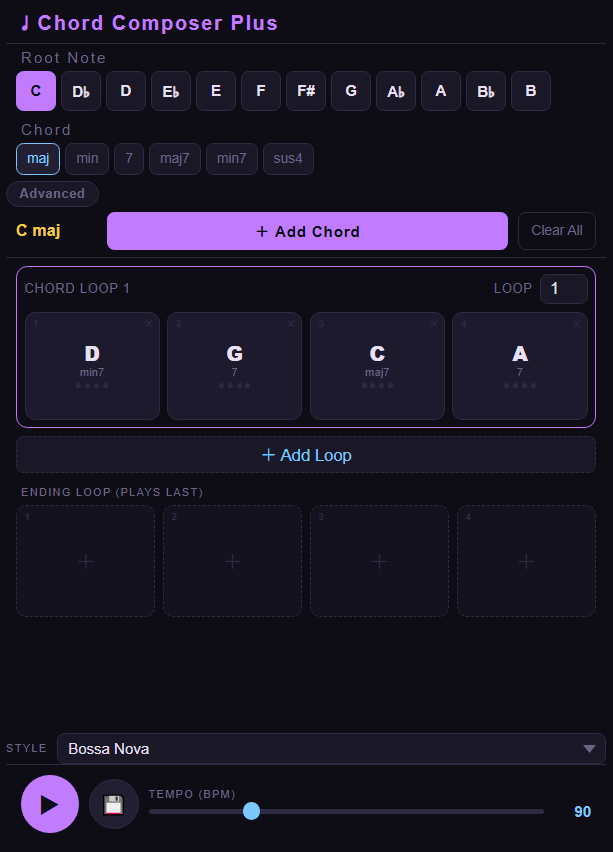

# Chord-Composer-Plus
A simple web-based application for creating and editing chord progressions.  
https://jinheong.github.io/Chord-Composer-Plus/  

## Demonstration video
https://youtu.be/nraT7xernys

## Features
* The panel size is designed for smartphone screen display
* Select from a variety of chord qualities and root notes
* Add and remove chords from the progression loop
* Multiple loops can be created for more complicated progression
* Edit optional ending loop, which will be played after the end of main chord progression loop
* Rhythm styles include Bossa Nova, Rumba, Power Chord, Ballad and Arpeggio
* Export audio files in WAV format
## Usage
1. Open chord-composer-plus.html in a web browser to access the application.
2. Select a root note and chord quality from the dropdown menus.
3. Add chords to the progression loop by clicking the "Add Chord" button.
4. Create a new progression loop after current progression by clicking the "Add Loop" button.
5. Edit chord progression patterns and style settings as needed.
6. Select rhythm patterns from STYLE.
7. Click the "Play" button to play the chord progression repeatedly followed by ending sequence.
(7. Export audio files (.wav) by clicking the "Export" button.)
## Dependencies
* Modern web browser (Chrome, Firefox, etc.)
* HTML5 and CSS3 capabilities
## License
This project is released under the [MIT License](https://opensource.org/licenses/MIT).
